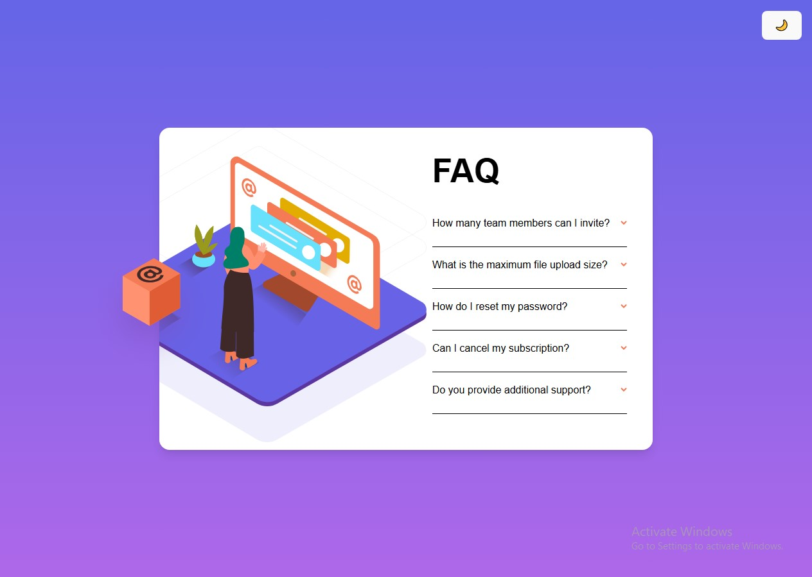

# 📋 FAQ Accordion Card

A responsive FAQ accordion card solution with smooth animations and dark mode support.



## ✨ Features
- Responsive design (mobile & desktop)
- Smooth expand/collapse animations
- Dark/Light mode toggle
- Accessible (keyboard navigable)
- Easy content management via JSON

## 🛠 Tech Stack
- React 18
- Tailwind CSS
- Framer Motion
- Vite

## 🗓 Development Timeline

| Week | Focus Area       | Key Features                     |
|------|------------------|----------------------------------|
| 1    | Core Improvements | CMS Integration, Dark Mode       |
| 2    | Design Upgrades  | Component Library, Animations    |
| 3    | Advanced Features| Search, PDF Export               |
| 4    | Final Polish     | Documentation, Demo Video        |

**Total Estimated Time:** ~30 hours

## 🚀 Quick Start
1. Install dependencies:
```bash
npm install
```
2. Run development server:
```bash
npm run dev
```
3. Open in browser:
```text
http://localhost:5173
```

## 📂 Project Structure
```text
src/
├── components/
│   └── Questions.jsx    # Accordion item component
├── data/
│   └── faqs.json        # FAQ content
├── App.jsx              # Main component
└── App.css              # Custom styles
```

## 🔧 Customization
- Edit questions: faqs.json
- Modify styles: App.css
- Adjust animations: Questions.jsx

## ⚠️ Known Issues
- Rotate classes in Questions.jsx may need Tailwind safelist
- Border colors should use opacity for better dark mode transition

## 📜 License
MIT Licensed. See [LICENSE](LICENSE) file.